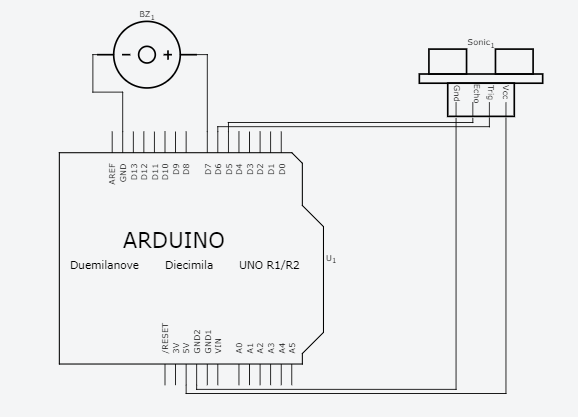

# Build a parking sensor that estimates distance using an ultrasonic sensor and produces a beeper signal with varied frequencies based on different threshold ranges. The electronic circuit is built based on Arduino Uno microcontroller. 

![Circuit] 

#include<ultrasonic.h>
Ultrasonic ultrasonic(6,5);
const int buzzer = 7;

void setup()
{
 pinMode(buzzer,OUTPUT);
 }
 
void loop()
{
 int dist = ultrasonic.Ranging(CM);
 if (dist<100) 
 {
  distance tone (buzzer,100);
  delay(40);
  noTone(buzzer);
  delay(dist * 4);
  }
delay(100);
}

REQUIREMENTS:

1. Arduino Uno
2. Buzzer
3. Ultrasonic Sensor
4. 5V Battery
5. LEDs - 3 different colors
6. Resistance
7. Jump Pins
